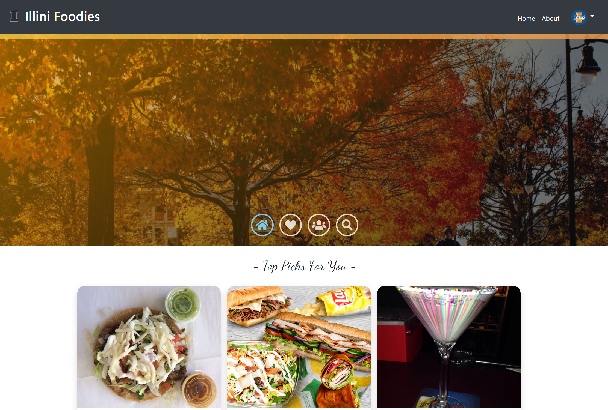
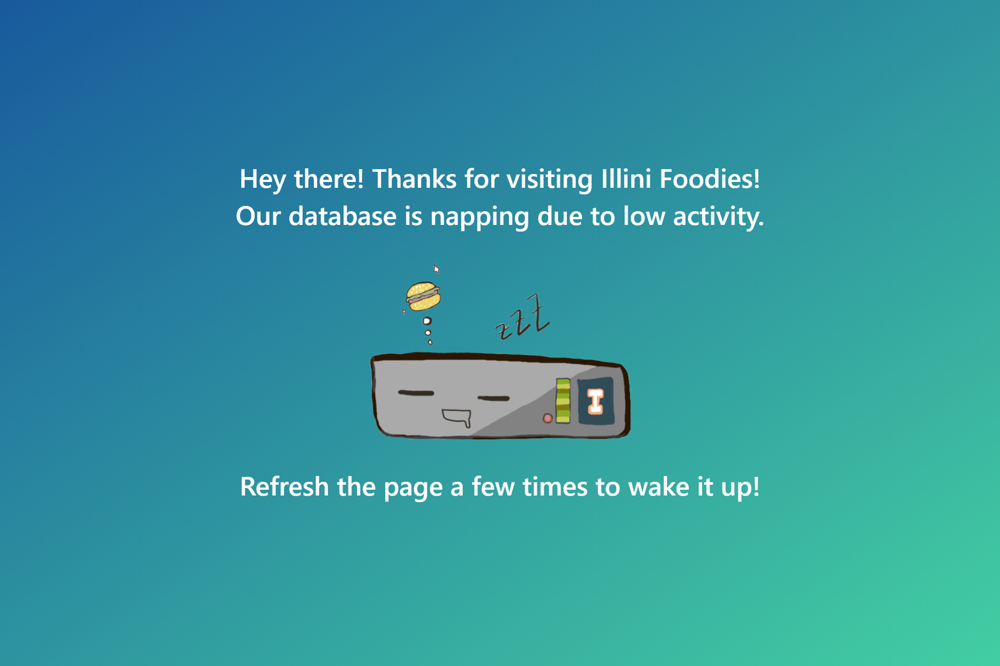
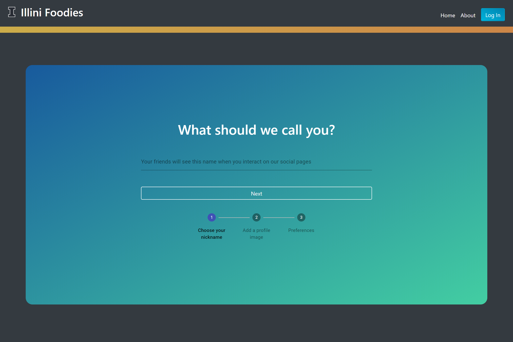
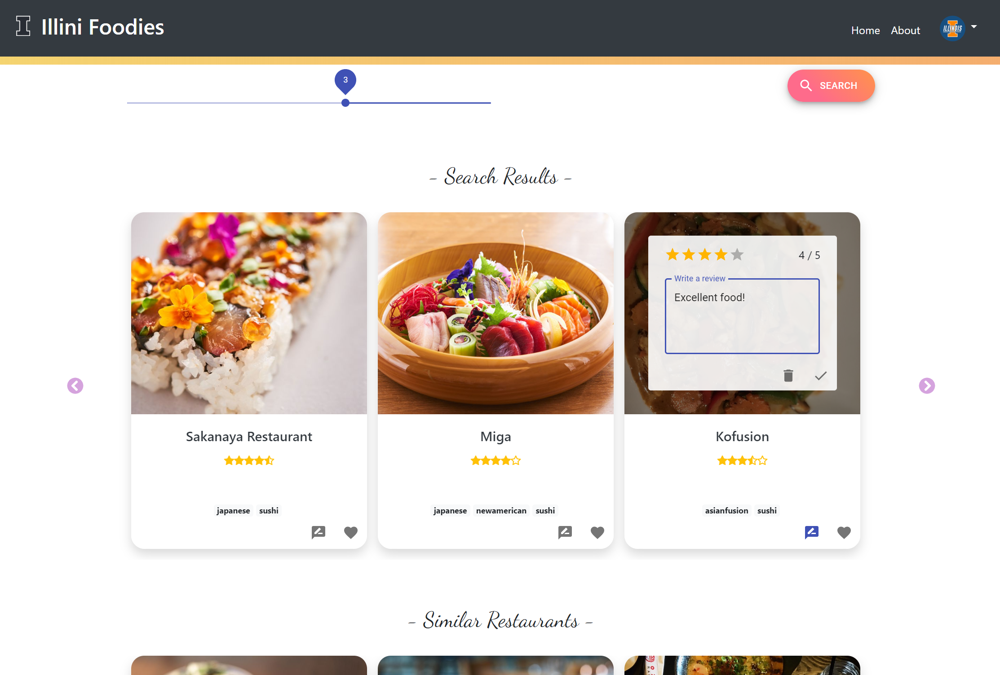
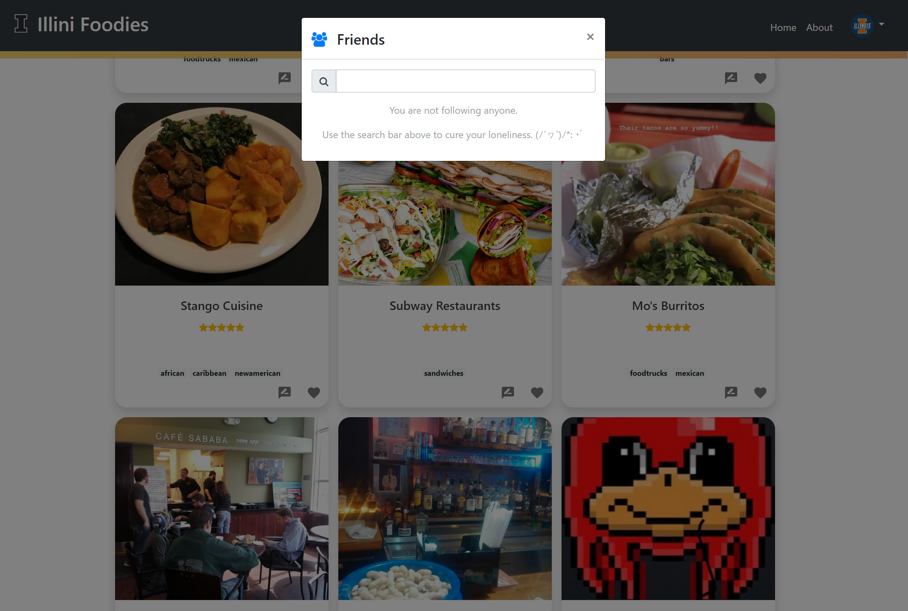

# 🌮 Illini Foodies

This is the front-end repo for [Illini Foodies](https://illinifoodies.xyz), implemented with React, Bootstrap, MaterialUI, FontAwesome and Axios. You can find the back-end [here](https://github.com/MaxProfit/IlliniFoodies-Backend)!

## Project Demo
Watch our project demo, presented by Roshini, [here](https://youtu.be/-BGyCtPfIco)!

## Gallery

## Resources
- Home page picture credits to the University of Illinois at Urbana-Champaign's LinkedIn
- Restaurant information sourced from Yelp

